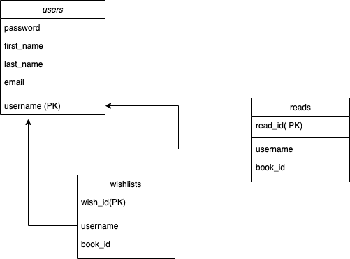

# 100-books-backend

# Description

It is the backend created for the 100-books project.

# Data



# Routes

# auth

[POST] /auth/register

- - POST /auth/register: { user } => { token }
- user must include { username, password, firstName, lastName, email }

[POST] /auth/token
-- POST /auth/token: { username, password } => { token }

```
{"username":"dog",
"password":"123456"}
```

# users

[GET] /users

- return all the users info

[GET] /users/:username

- return the user's info
- sample return

* ```
     {
      "users": {
        "username": "testuser",
        "firstName": "Test",
        "lastName": "User",
        "email": "joel@joelburton.com",
        "reads": [
          "qMB4DwAAQBAJ",
          "bCpzAgAAQBAJ",
          "u1LaDwAAQBAJ",
          "bKRPXoFe728C"
        ],
        "wishlist": [
          "crrfVT2XdmoC",
          "ca9EAQAAMAAJ"
        ]
      }
    }
  ```
  [DELETE] users/:username

- delete the user

[POST] users/:username/read/:id

- add user's read book id
  [DELETE] users/:username/unread/:id
- delete user's read book id

[POST] users/wish/:id

- add user's wishlist book id
  [DELETE] users/unwish/:id
- remove users wish book id

[PATCH] users/:username

- ensure correct user. Only the correct user can patch the user.

* Data can include:
* { firstName, lastName, password, email }
*
* Returns { username, firstName, lastName, email }
*

To be continue.
